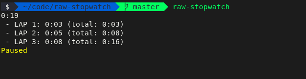

# raw-stopwatch

No-frills fork of [codealchemist/stopwatch-cli](https://github.com/codealchemist/stopwatch-cli).



## Install

`npm install -g raw-stopwatch`

## Usage

```
$ raw-stopwatch
```

Keyboard interface:

- `ENTER`: Creates a lap.
- `SPACE`: Pauses the timer.
- `q` or `ctrl+c`: Quit.
